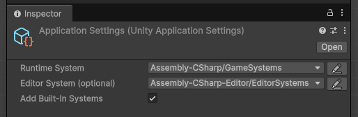

# Unity Library

This package provides boilerplate for organizing code in a tree of systems that can listen to events.

### Installation

Use the following URL in Unity's package manager:
```
https://github.com/popcron-games/unity-library.git
```

### Systems

Systems are what get added and removed during the application lifecycle:
```cs
[Preserve]
public class GameSystem : SystemBase
{
    public GameSystem(VirtualMachine vm) : base(vm)
    {
        // equivalent to static constructor
    }

    public override void Dispose()
    {
        // equivalent to static destructor
    }
}
```

### Application settings asset



All projects will have a singleton application settings asset.
It states what systems should be added for the runtime and editor lifecycles.
* Runtime lifecycle = Both in editor and during play, as well as in builds
* Editor lifecycle = Only in editor

### Receiving Unity engine events

Events from the Unity engine can be received by all systems:
```cs
public class MySystem : IListener<ApplicationStarted>, IListener<ApplicationFinished>
{
    void IListener<ApplicationStarted>.Receive(VirtualMachine vm, ref ApplicationStarted e)
    {
        Debug.Log("Playing started");
    }

    void IListener<UpdateEvent>.Receive(VirtualMachine vm, ref UpdateEvent e)
    {
        Debug.Log(e.delta);
    }

    void IListener<ApplicationFinished>.Receive(VirtualMachine vm, ref ApplicationFinished e)
    {
        Debug.Log("Playing stopped");
    }
}
```

These events broadcast if "add built in systems" is enabled in your settings asset.

### Enumerating through Unity objects

Unity objects that register themselves with the `UnityObjects` system are able receive events,
just like systems are. And can also be cheaply polled:
```cs
public class Pickup : MonoBehaviour, IListener<FixedUpdate>
{
    public static IReadOnlyList<Pickup> All => UnityApplication.VM.GetFirstSystem<UnityObjects>().GetAllThatAre<Pickup>();

    [SerializeField]
    private GameObject effectPrefab;

    private void OnEnable()
    {
        UnityApplication.VM.GetFirstSystem<UnityObjects>().Register(this);
    }

    private void OnDisable()
    {
        UnityApplication.VM.GetFirstSystem<UnityObjects>().Unregister(this);
    }

    void IListener<FixedUpdate>.Receive(VirtualMachine vm, ref FixedUpdate e)
    {
        // do some logic in fixed update
    }
}
```

### Contributing and design

This package emerged from years of trying to write quality code. It is a boiled down
version of what I rewrote countless times that helped me make safer, and reliable code.

Contributions that fit this are welcome.