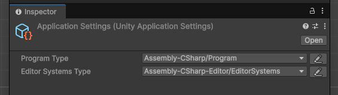

# Unity Library

A framework for Unity.

### Programs and systems

Programs are surface level objects that are operated by a virtual machine.
They, along with systems are able to receive events using the `IListener<T>` interface:
```cs
[Preserve]
public class GameProgram : IProgram
{
    void IProgram.Start(VirtualMachine vm)
    {
        vm.AddSystem(new UnityLibrarySystems(vm)); //explained further below
        vm.AddSystem(new MySystem(vm));
    }

    void IProgram.Stop(VirtualMachine vm)
    {
        vm.RemoveSystem<MySystem>().Dispose();
        vm.RemoveSystem<UnityLibrarySystems>().Dispose();
    }
}

public class MySystem : IDisposable
{
    private readonly VirtualMachine vm;

    public MySystem(VirtualMachine vm)
    {
        this.vm = vm;
        //equivalent to static constructor
    }

    public void Dispose()
    {
        //equivalent to static destructor
    }
}
```

### Configuration asset



All projects will have a single configuration asset that states what type is used as the program.
As well as a reference to the initial assets. This asset is found procedurally at runtime:

### Playing from start


The original play button in the Unity editor has the behaviour of playing from the current scene.
In addition to that, there is a new play button that plays from the first scene in the build settings:

### Validation


Included is a `Validate` event, called when either of the two play buttons
are used. If any of them report an error, then entering play is disallowed.
By default, this runs for all systems:
```cs
public class MySystem : IListener<Validate>
{
    void IListener<Validate>.Receive(VirtualMachine vm, ref Validate e)
    {
        Assert.Fail(); //this system will always prevent play
    }
}
```

Validation can also be performed before attempting to play:

### The `UnityLibrarySystems` type

This system type is a wrapper for `UnityObjects` and `UnityEventDispatcher`. Overall it provides these characteristics:

**Events from the Unity runtime will be dispatched**:

```cs
public class MySystem : IListener<ApplicationStarted>, IListener<UpdateEvent>, IListener<ApplicationFinished>
{
    void IListener<ApplicationStarted>.Receive(VirtualMachine vm, ref ApplicationStarted ev)
    {
        Debug.Log("Playing started");
    }

    void IListener<UpdateEvent>.Receive(VirtualMachine vm, ref UpdateEvent ev)
    {
        Debug.Log(ev.delta);
    }

    void IListener<ApplicationFinished>.Receive(VirtualMachine vm, ref ApplicationFinished ev)
    {
        Debug.Log("Playing stopped");
    }
}
```

**Objects that register with `UnityObjects` can be polled, and receive events with `IListener<T>`**

```cs
public class Pickup : MonoBehaviour
{
    private static UnityObjects Registry => UnityApplication.VM.GetSystem<UnityObjects>();

    //exposes a list of all pickups in the scene
    public static IReadOnlyList<Pickup> All => Registry.GetAllThatAre<Pickup>();

    private void OnEnable()
    {
        Registry.Register(this);
    }

    private void OnDisable()
    {
        Registry.Unregister(this);
    }
}
```

### CustomMonoBehaviour and CustomScriptableObject

These two types are wrappers for `MonoBehaviour` and `ScriptableObject`. They register
themselves with `UnityObjects` in `OnEnable()` and `OnDisable()` events, allowing them
to be polled and receive events:
```cs
public class TheComponent : CustomMonoBehaviour, IListener<Validate>, IListener<UpdateEvent>
{
    [SerializeField] private Vector2 thing; //must not be 0, 0

    void IListener<Validate>.Receive(VirtualMachine vm, ref Validate e)
    {
        Assert.That(thing, Is.Not.EqualTo(default(Vector2)));
    }

    void IListener<UpdateEvent>.Receive(VirtualMachine vm, ref UpdateEvent e)
    {
        Debug.Log($"Update event: {e.delta}");
    }

    public static bool TryFindWithValue(Vector2 value, [NotNullWhen(true)] out TheComponent? component)
    {
        //finds the first component with the given value
        foreach (TheComponent c in Registry.GetAllThatAre<TheComponent>())
        {
            if (c.thing == value)
            {
                component = c;
                return true;
            }
        }

        component = null;
        return false;
    }
}
```

Works with `[ExecuteAlways]`.

### Contributing and design

This Unity package provides the scaffolding needed to write code that may not
need to depend on Unity. While providing high level tools that help make
safer and reliable code.

Contributions to this goal are welcome.